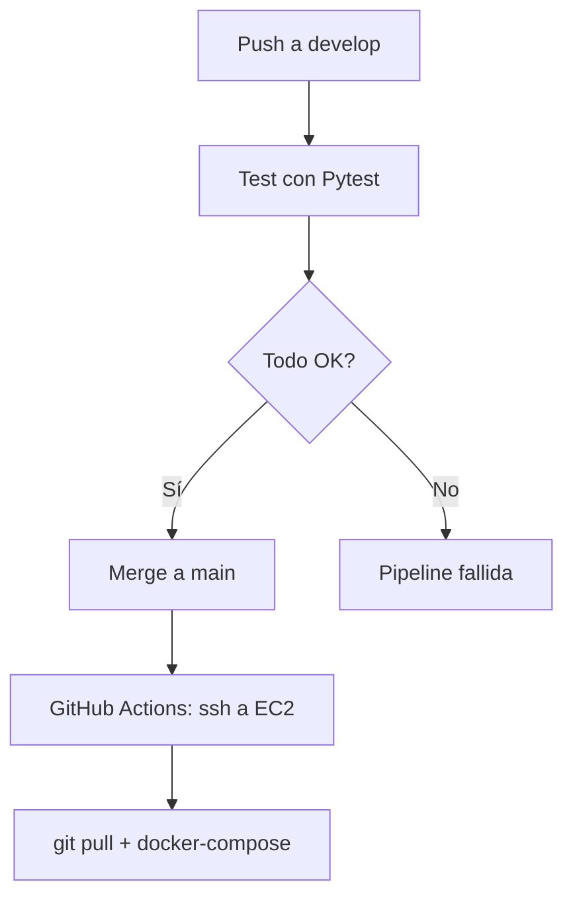

# 🚀 Proyecto DevOps Python – CI/CD con GitHub Actions + AWS + Terraform

Este proyecto educativo demuestra cómo implementar un flujo de integración y entrega continua (CI/CD) usando GitHub Actions y despliegue automático a una instancia EC2 en AWS. La aplicación está desarrollada en **Python + Flask**, se ejecuta en contenedores Docker, y su infraestructura es gestionada con **Terraform**.

## 📦 Tecnologías utilizadas

| Capa               | Herramienta                    |
| ------------------ | ------------------------------ |
| Lenguaje principal | Python 3.11                    |
| Framework web      | Flask                          |
| Testing            | Pytest                         |
| Contenedores       | Docker, Docker Compose         |
| CI/CD              | GitHub Actions                 |
| Infraestructura    | Terraform (EC2, SG, Key Pair)  |
| Despliegue         | SSH desde GitHub Actions a EC2 |

## 📁 Estructura del proyecto

```bash
proyecto-python-devops/
├── app/                  # Código de la aplicación Flask
│   ├── __init__.py
│   └── app.py
├── tests/                # Tests con pytest
│   └── test_app.py
├── terraform/            # Infraestructura con Terraform
│   ├── main.tf
│   ├── variables.tf
│   ├── outputs.tf
├── .github/
│   └── workflows/
│       └── deploy.yml    # Workflow de GitHub Actions
├── Dockerfile
├── docker-compose.yml
├── requirements.txt
└── README.md
```

## 🧱 Infraestructura con Terraform (EC2)

### 1. Configura el archivo `variables.tf`

Asegúrate de definir:

```hcl
variable "public_key_path" {
  default = "~/.ssh/id_rsa.pub" # o la que estés usando
}

variable "my_ip" {
  default = "TU.IP.PUBLICA/32" # Ej: "181.55.32.88/32"
}
```

### 2. Inicia y aplica Terraform

```bash
cd terraform
terraform init
terraform apply
```

### 3. Obtén la IP de tu EC2

```bash
terraform output
```

## 🖥️ Configuración inicial de la instancia EC2

Conéctate a la instancia:

```bash
ssh -i ~/.ssh/id_rsa ubuntu@<IP_PUBLICA>
```

### 🔧 Instalar Docker, Git y Docker Compose

```bash
# Actualizar el sistema
sudo apt update && sudo apt upgrade -y

# Instalar Docker
sudo apt install -y docker.io

# Habilitar y arrancar Docker
sudo systemctl enable docker
sudo systemctl start docker

# Agregar tu usuario a docker (requiere reiniciar sesión)
sudo usermod -aG docker $USER

# Instalar Docker Compose
sudo apt install -y docker-compose

# Instalar Git
sudo apt install -y git
```

### 🔁 Salir y volver a entrar para aplicar cambios de grupo

```bash
exit
ssh -i ~/.ssh/id_rsa ubuntu@<IP_PUBLICA>
```

## 📥 Clonar el repositorio y probar manualmente

```bash
git clone https://github.com/TU_USUARIO/proyecto-python-devops.git
cd proyecto-python-devops

docker-compose up -d --build
```

Verifica desde la instancia:

```bash
curl http://localhost:5000/health
```

Y desde tu navegador local:

```bash
http://<IP_PUBLICA>:5000/health
```

## 🔐 Configuración de Secrets en GitHub

Ve a `Settings > Secrets > Actions` en tu repositorio y agrega:

| Nombre           | Valor (secreto)                                                                    |
| ---------------- | ---------------------------------------------------------------------------------- |
| `EC2_HOST`       | IP pública de la instancia EC2 (obtenida desde Terraform)                          |
| `EC2_USER`       | Usuario SSH, por ejemplo: `ubuntu`                                                 |
| `EC2_KEY_BASE64` | Clave privada SSH codificada en base64: `base64 -i ~/.ssh/id_rsa` (una sola línea) |

## ▶️ ¿Cómo funciona el flujo CI/CD?

Cada vez que haces `push` a la rama `main`:

- Se ejecutan los tests en GitHub Actions
- Si todo pasa, GitHub se conecta por SSH a tu EC2 y despliega

## 🧪 Ejecutar tests localmente

```bash
pytest
```

## 📈 Diagrama del flujo CI/CD



## 🎓 ¿Qué aprende el estudiante?

- Cómo usar Git, Docker, Terraform, Python y GitHub Actions de forma conjunta
- Cómo automatizar pruebas y despliegues
- Cómo montar una arquitectura mínima CI/CD moderna
- Cómo gestionar claves SSH, variables de entorno y flujos de trabajo seguros

## Autor

- [Brayan Diaz C](https://github.com/brayandiazc)

## Licencia

Este proyecto está licenciado bajo la Licencia MIT - consulta el archivo [LICENSE](LICENSE) para más detalles.

---

⌨️ con ❤️ por [Brayan Diaz C](https://github.com/brayandiazc) 😊
